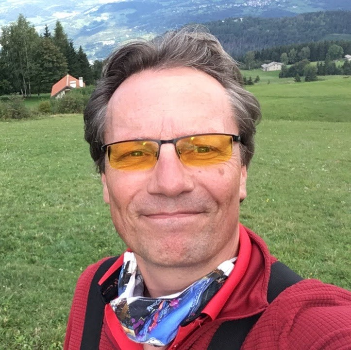

# Wie is Bennert

Mijn naam is Bennert de Wijs en ik ben geboren en getogen in Veldhoven.

Ik heb een Mavo-diploma, gevolgd door een MTS Electronica- en een HTS Informatica diploma.

Ik heb gewerkt als Field Service Engineer van 1996 tot 2000, als Software Engineer van 2000 tot 2007 en daarna als Software Test Engineer en Test Automation Engineer.

Mijn hobby's zijn Home Automation, handbal en paragliding.

Vanaf mijn 6e tot mijn 26e heb ik bij [scouting](https://www.scouting.nl/) gezeten, eerst als lid en later als leiding en hopman van de scouts (kinderen van 10 tot 14 jaar).

Ik vind het leuk om processen te verbeteren, zowel als hopman, thuis en in mijn werk, en het geeft me veel energie.

Een van mijn leukste werkopdrachten was het [Philips hue](https://www.philips-hue.com/)-project, waarbij ik het hele continuous integration-proces heb opgezet met [Jenkins](https://www.jenkins.io/). Deze kennis heb ik later gebruikt om het continuous integration-proces bij het [UroNav](https://www.google.com/url?sa=t&rct=j&q=&esrc=s&source=web&cd=&cad=rja&uact=8&ved=2ahUKEwjb97X7hLKCAxVmwAIHHfQIAHgQFnoECBAQAQ&url=https%3A%2F%2Fwww.philips.nl%2Fhealthcare%2Fproduct%2FHC784026%2Furonav-mrultrasound-guided-fusion-biopsy-system&usg=AOvVaw3ua3E6O4wgtpJS0Md6G9cI&opi=89978449)-team te verbeteren, waaronder het toevoegen van testautomatisering en automatische testrapportage, en daarna bij het Uplanner-project om het continuous integration- en continuous delivery-proces te verbeteren.

Ik heb een sterk abstractievermogen en kan concepten afleiden uit concrete situaties. Ik ben innovatief en denk voortdurend vanuit mijn creativiteit na over vernieuwingen. Ik ben goed in het bedenken van nieuwe, gevarieerde en creatieve ideeën. Ik heb een groot leervermogen en kan snel iets nieuws eigen maken en leren uit ervaring. Ik ben omgevingssensitief en sta open voor anderen en voor de omgeving.

Wat werk betreft ben ik altijd op zoek naar nieuwe uitdagingen waarbij ik mijn talenten kan inzetten en verder kan ontwikkelen.
