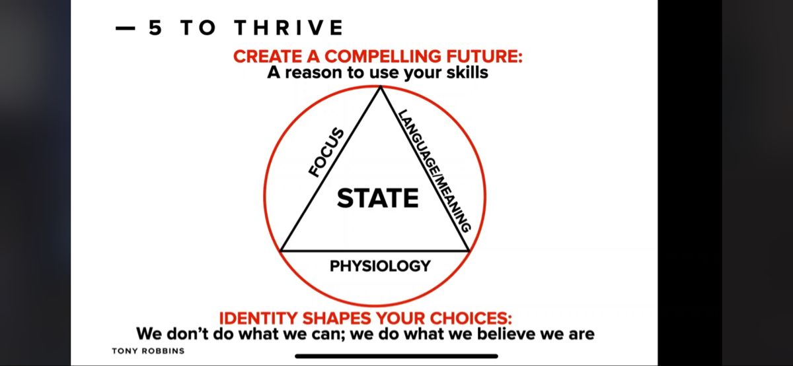

# Empowering State

The foundation for creating lasting change is having an empowering state

How do you do that?

Train your body by change your state

## 1 Physiology

There's a physicality to every emotion we choose

Make a radical change to your physiology by:

* Jump up and down.
* Dance.
* Do the power pose.
* Listen to powerful music.
* Use your voice

## 2 Focus

Focus = Feeling

What are you focusing on?

Life is unfair versus I am resourceful and I can find a way

## 3 Language/Meaning

The words we use create our emotions.

Language creates meaning

Meaning creates emotion

This situation sucks vs **this situation is challenging and delightful**

## 4 Create a compelling future

A reason to use your skills

How to make these changes last?

You actually need to create and declare a compelling future ie even though it is tough today, I am going through it because I want that body and energy so I can be there for my kids and kick goals in my business

## 5 Identity shapes your choices

We don't do what we can; We do what we believe we are

Identity. This is not a set and forget. We need to condition ourselves to absorbing our new empowering identities. This includes **daily practices** of feeding our mind, **incantations**, stretching ourselves and sharing who we are now