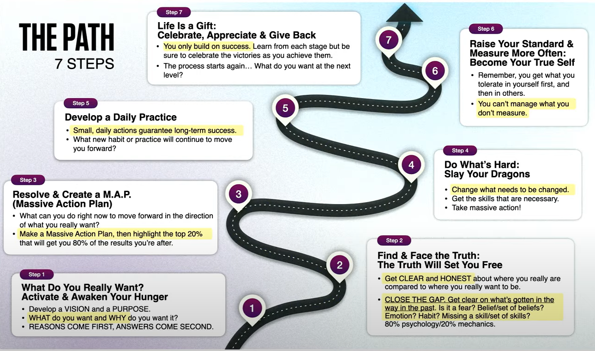

# Path to Growth

## Step 1: What Do You Really Want?

> Activate & Awaken Your Hunger

* Develop a VISION and a PURPOSE
* WHAT do you want and WHY do you want it?
* REASONS COME FIRST, ANSWERS COME SECOND

## Step 2: Find & Face the Truth

> The Truth Will Set You Free

* Get CLEAR and HONEST about where you really are compared to where you really want to be (be specific)
* CLOSE THE GAP. Get clear on what's gotten in the way in the past. Is it fear, Belief / set of beliefs, emotion, habit, missing a skill / set of skills? (80% psychological / 20% mechanical)

## Step 3: Create a Massive Action Plan (M.A.P.)

* What are 2-3 things you can do right now to move forward in the direction of what you really want? Can be a small action or a big action
* How will you get the skill you need? How will you get yourself to embody the qualities necessary to achieve your vision?
* Make a Massive Action Plan, then highlight the top 20% that will get you 80% of the results you're after

## Step 4: Do What's Hard

> Slay Your Dragons

* Change what needs to be changed
* Get the skills that are necessary
* Take massive action
* Transform to your new identity, story and reality

## Step 5: Develop a Daily Practice

* Small, daily actions guarantee long-term success
* What new habit(s) or practice will continue to move you forward?
* What will you do to embody the character traits, skills and psychology of a person who will live your vision?
* Most importantly, measure your state, 0-10 and make mistake immediate adjustments when it's not in line with your path

## Step 6: Raise Your Standard & Measure More Often

> Become Your True Self

* Remember, you get what you tolerate in yourself first, and the in others
* You can't manage what you don't measure

## Step 7: Life Is a Gift

> Celebrate, Appreciate & Give Back

* You only build on success. Learn from each stage but be sure to celebrate the victories as you achieve them
* The process starts again... What do you want at the next level?