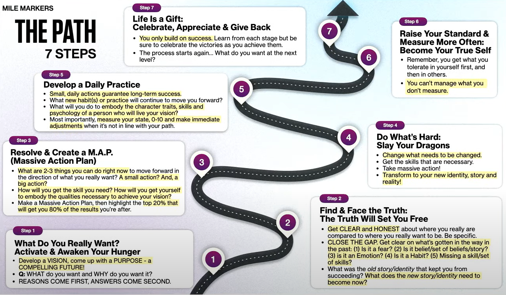

# Pad naar Groei

## Stap 1: Wat wil je echt? => Activeer en wek uw honger

* Ontwikkel een VISIE en een DOEL
* WAT wil je en WAAROM wil je het?
* REDENEN KOMEN EERST, ANTWOORDEN KOMEN TWEEDE

## Stap 2: Vind en zie de waarheid onder ogen => De waarheid zal je bevrijden

* Wees DUIDELIJK en EERLIJK over waar u werkelijk staat, vergeleken met waar u werkelijk wilt zijn
* SLUIT DE KLOOF. Maak duidelijk wat er in het verleden in de weg heeft gestaan. Is het angst, geloof/set van overtuigingen, emotie, gewoonte, het missen van een vaardigheid/set van vaardigheden? (80% psychologie / 20% mechanica)

## Stap 3: Oplossen en creëren van een M.A.P. (Enorm actieplan)

* Wat kun je nu doen om vooruit te komen in de richting van wat je echt wilt?
* Maak een grootschalig actieplan en markeer vervolgens de top 20% die u 80% van de gewenste resultaten oplevert

## Stap 4: Doe wat moeilijk is => Dood je draken

* Verander wat er veranderd moet worden
* Verkrijg de vaardigheden die nodig zijn
* Onderneem massale actie

## Stap 5: Ontwikkel een dagelijkse praktijk

* Kleine, dagelijkse acties garanderen succes op de lange termijn
* Welke nieuwe gewoonte of praktijk zal je vooruit blijven helpen?

## Stap 6: Verhoog je standaard en meet vaker => Word je ware zelf

* Onthoud dat je eerst krijgt wat je in jezelf tolereert, en dat in anderen
*Wat je niet meet, kun je niet beheren

## Stap 7: Het leven is een geschenk => Vier, waardeer en geef terug

* Je bouwt alleen op succes. Leer van elke fase, maar zorg ervoor dat je de overwinningen viert terwijl je ze behaalt
* Het proces begint opnieuw... Wat wil je op het volgende niveau?