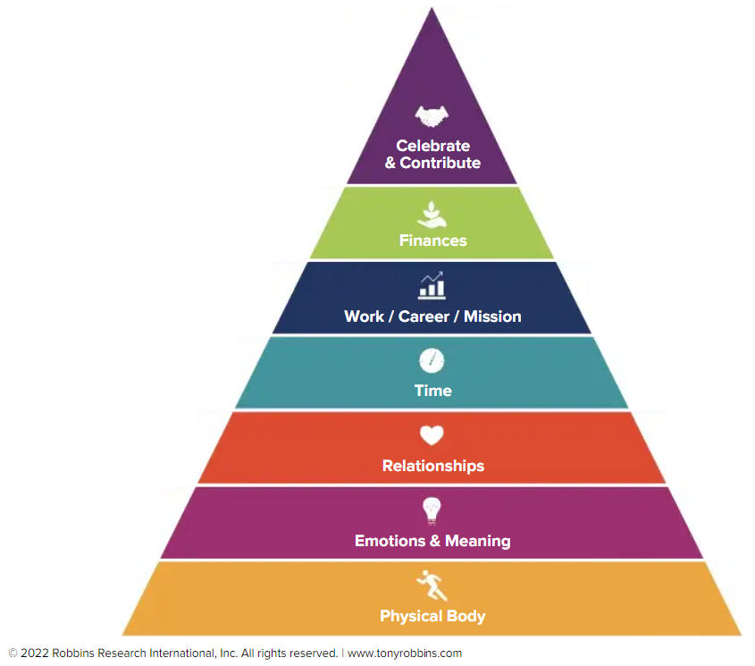

# Piramide van Meesterschap

De Pyramide of Meesterschap is een raamwerk ontwikkeld door Tony Robbins om de verschillende niveaus van persoonlijke groei en prestatie te illustreren. Het bestaat uit de volgende niveaus:

## 1. Lichamelijke gezondheid

Aan de basis van de piramide staat lichamelijke gezondheid. Zonder een goede gezondheid wordt het moeilijk om succes te behalen op andere gebieden van het leven. Dit niveau omvat aspecten zoals voeding, lichaamsbeweging en algeheel welzijn.

## 2. Emotionele fitheid

Emotionele fitheid verwijst naar het vermogen om iemands emoties effectief te beheersen en te reguleren. Dit niveau omvat het ontwikkelen van emotionele intelligentie, veerkracht en het vermogen om met stress en uitdagingen om te gaan.

## 3. Relaties

Het volgende niveau zijn relaties, die zowel persoonlijke als professionele connecties omvatten. Het opbouwen en onderhouden van gezonde relaties is cruciaal voor persoonlijke groei en succes.

## 4. Tijd en geld

Dit niveau richt zich op het effectief beheren van tijd en het ontwikkelen van financiële intelligentie. Het gaat om het stellen van doelen, het beheren van middelen en het nemen van verstandige financiële beslissingen.

## 5. Carrière en missie

Het carrière- en missieniveau gaat over het vinden van doel en vervulling in iemands werk. Het gaat om het afstemmen van iemands carrière op persoonlijke waarden en passies.

## 6. Viering en bijdrage

Het hoogste niveau van de piramide gaat over het vieren van prestaties en het teruggeven aan anderen. Het gaat om het maken van een positieve impact op de wereld en het bijdragen aan iets dat groter is dan jezelf.

Door elk niveau van de Piramide van Meesterschap te begrijpen en eraan te werken, kunnen individuen holistische persoonlijke groei en vervulling bereiken.