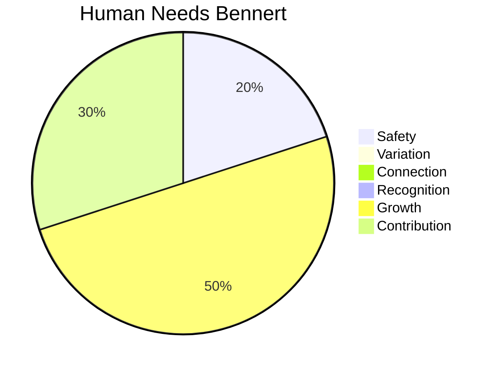

# Personality

On this page I describe my personality with what my [human needs](#human-needs) and what my [talents](#talents) are.

## Human Needs

The Six Human Needs aims to understand a person's emotional and psychological needs.

My Human Needs according to Tony Robbins are:

* Grow
* Contribution
* Safety

## Talents

Here is an overview of my talents

| ID | Talent |
| --- | --- |
| 1. | Adaptive |
| 2. | Analytical skills |
| 3. | Abstraction ability |
| 4. | Helpful |
| 5. | Involved |
| 6. | Reliable |
| 7. | Perseverant |
| 8. | Honest |
| 9. | Efficient |
| 10.| Flexible |
| 11.| Patient |
| 12.| Thorough |
| 13.| Empathy |
| 14.| Innovative thinking |
| 15.| Eager to learn |
| 16.| Learning ability |
| 17.| Logical thinking |
| 18.| Loyal |
| 19.| Sober |
| 20.| Environmentally sensitive |
| 21.| Solution thinking skills |
| 22.| Optimistic |
| 23.| Positive |
| 24.| Practical attitude |
| 25.| Relativized |
| 26.| Seriously |
| 27.| Stable |
| 28.| Resourceful |
| 29.| Friendly |
| 30.| Self-control |
| 31.| Working independently |
| 32.| Caring |

[Home](../index.en.md)