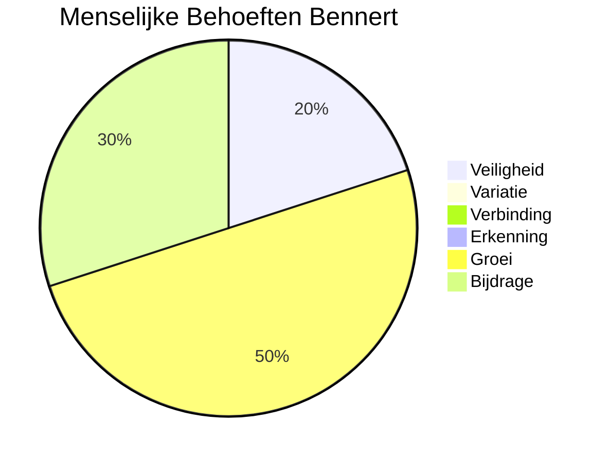

# Menselijke Behoeften en Talenten

## Menselijke Behoeften

De zes menselijke behoeften is erop gericht om de emotionele en psychologische behoeften van een persoon te begrijpen.

Mijn Menselijke Behoeften volgens Tony Robbins zijn:

* Groei
* Bijdrage
* Veiligheid

Wil je weten wat jouw Menselijke Behoeften zijn?

Vul dan de [Questionnaire 6 Human Needs](https://forms.office.com/Pages/ResponsePage.aspx?id=a8ulgCGuqE69PyXgBc78W7s_cNsMqNxCkhi68glGcH5UNUNNWVgzR0wyRVRPT1pWQkZRMkxJVlU1Qi4u) in

## Talenten

Hierbij een overzicht van mijn talenten

| ID | Talent |
| --- | --- |
| 1. | Adaptief |
| 2. | Analytisch vermogen |
| 3. | Abstractie vermogen |
| 4. | Behulpzaam |
| 5. | Betrokken |
| 6. | Betrouwbaar |
| 7. | Doorzettingsvermogend |
| 8. | Eerlijk |
| 9. | Efficiënt |
| 10.| Flexibel |
| 11.| Geduldig |
| 12.| Grondig |
| 13.| Inlevingsvermogen |
| 14.| Innovatief denkvermogen |
| 15.| Leergierig |
| 16.| Leervermogen |
| 17.| Logisch denken |
| 18.| Loyaal |
| 19.| Nuchter |
| 20.| Omgevingssensitief |
| 21.| Oplossend denkvermogen |
| 22.| Optimistisch |
| 23.| Positief |
| 24.| Praktisch ingesteld |
| 25.| Relativeringsvermogend |
| 26.| Serieus |
| 27.| Stabiel |
| 28.| Vindingrijk |
| 29.| Vriendelijk |
| 30.| Zelfbeheersing |
| 31.| Zelfstandig werkend |
| 32.| Zorgzaam |

[Home](../index.md)