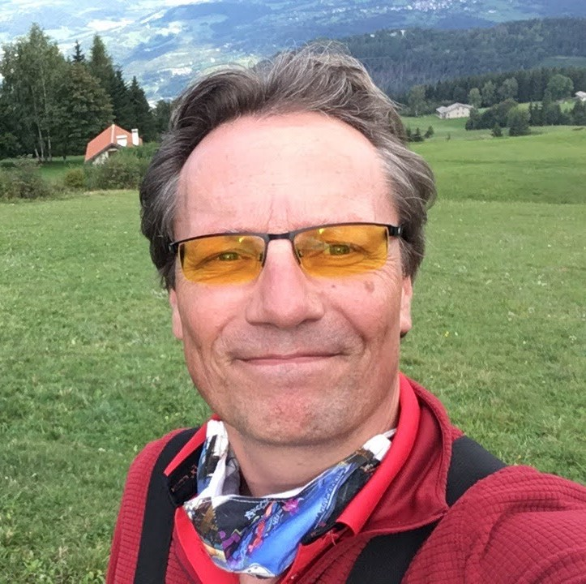

# Who is Bennert

My name is Bennert de Wijs and I was born and raised in Veldhoven.

I have a MAVO diploma, followed by an MTS Electronics and an HTS Computer Science diploma.

I worked as a Field Service Engineer from 1996 to 2000, as a Software Engineer from 2000 to 2007 and then as a Software Test Engineer and Test Automation Engineer.

My hobbies are Home Automation, handball and paragliding.

From the age of 6 to the age of 26 I joined [scouting](https://www.scouting.nl/), first as a member and later as a leader and leader of the scouts (children aged 10 to 14).

I enjoy improving processes, both as a scoutmaster, at home and in my work, and it gives me a lot of energy.

One of my favorite work assignments was the [Philips hue](https://www.philips-hue.com/) project, where I set up the entire continuous integration process with [Jenkins](https://www.jenkins .io/). I later used this knowledge to improve the continuous integration process at [UroNav](https://www.google.com/url?sa=t&rct=j&q=&esrc=s&source=web&cd=&cad=rja&uact=8&ved=2ahUKEwjb97X7hLKCAxVmwAIHHfQIAHgQFnoECBAQAQ&url= https%3A%2F%2Fwww.philips.nl%2Fhealthcare%2Fproduct%2FHC784026%2Furonav-mrultrasound-guided-fusion-biopsy-system&usg=AOvVaw3ua3E6O4wgtpJS0Md6G9cI&opi=89978449) team, including adding test automation and automatic test reporting, and beyond in the Uplanner project to improve the continuous integration and continuous delivery process.

I have strong abstraction skills and can derive concepts from concrete situations. I am innovative and constantly think about innovations based on my creativity. I am good at coming up with new, varied and creative ideas. I have a great learning capacity and can quickly master something new and learn from experience. I am environmentally sensitive and open to others and the environment.

When it comes to work, I am always looking for new challenges where I can use and further develop my talents.
